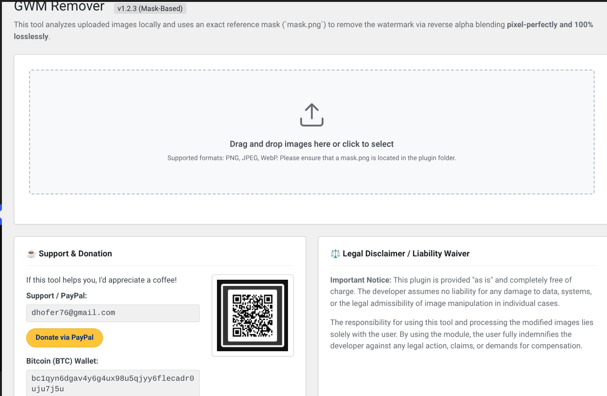

# GWM Remover

**Contributors:** Dominique Blake-Hofer (blake-hofer.net)  
**Requires at least:** 5.0  
**Tested up to:** 6.5  
**Stable tag:** 1.2.3  
**License:** GPLv2 or later  
**License URI:** https://www.gnu.org/licenses/gpl-2.0.html

A lightweight, privacy-first WordPress plugin for blog operators to securely remove Gemini watermarks from AI-generated images using exact reverse alpha blending.

### Plugin Teaser

## Description

**GWM Remover** is built specifically for blog operators and content creators who use Google Gemini to generate images but need a clean, unbranded look for their articles. 

Instead of relying on third-party tools or heavy server-side AI processing, this plugin empowers you to process images directly within your own WordPress dashboard. It uses a highly accurate, mask-based **Reverse Alpha Blending** algorithm to reconstruct the original background details losslessly.

### 🔒 100% Privacy & Zero Server Load
Security and privacy are the core features of this plugin:
* **Completely Local Processing:** The images are **never** uploaded to your WordPress server. The entire mathematical removal process happens securely and locally within the RAM of your browser (using HTML5 Canvas & JavaScript).
* **Zero Bandwidth Usage:** Since no files are uploaded to the server, you save bandwidth and bypass any WordPress upload limits.
* **Complete Metadata Destruction:** Re-rendering the image through the browser canvas natively and irrevocably strips all hidden tracking data, EXIF data, C2PA labels, and digital SynthID traces before you even download the file.

### Features
* Drag-and-drop interface integrated directly into the WordPress admin area.
* Pixel-perfect watermark removal with zero background distortion.
* Instant processing in milliseconds.
* Bulk processing support for multiple images at once.

## Installation

There are two ways to install this plugin: via the official ZIP release (recommended) or manually via Git/Source download.

### Method 1: The Easy Way (ZIP Download)
1. Navigate to the **Releases** section on the right side of this GitHub repository.
2. Download the latest `gwm-remover.zip` file.
3. In your WordPress dashboard, go to **Plugins** &rarr; **Add New** &rarr; **Upload Plugin**.
4. Choose the downloaded ZIP file, click **Install Now**, and then **Activate**.
5. **Important:** Connect to your server via FTP/SFTP and upload the `mask.png` file directly into the newly created `/wp-content/plugins/gwm-remover/` directory.

### Method 2: Manual Source Download
1. Click the green **Code** button at the top of this repository and select **Download ZIP**.
2. Extract the downloaded ZIP file on your computer. 
3. **Important:** Rename the extracted folder from `gwm-remover-main` to exactly `gwm-remover`.
4. Upload the entire `gwm-remover` folder via FTP/SFTP to your `/wp-content/plugins/` directory.
5. Ensure the `mask.png` file is located inside this folder.
6. Go to the **Plugins** screen in your WordPress dashboard and click **Activate** under "GWM Remover".

### Plugin Interface

## Usage

1. In your WordPress dashboard, navigate to **Tools** &rarr; **GWM Remover**.
2. You will see a dedicated dropzone area. Drag and drop your Gemini-generated images (PNG, JPEG, WebP) into this area, or click the box to select files from your computer.
3. The plugin immediately processes the images locally in your browser.
4. Once the status changes to "Perfectly Cleaned", click the **Download** button below the image.
5. The clean, metadata-free image will be saved directly to your computer, ready to be uploaded to your WordPress Media Library for your blog posts.

## Support & Donation

This tool is developed and maintained in my free time and provided completely free of charge. If it saves you time and helps your blog, consider buying me a coffee!

* **Support / Contact:** dhofer76@gmail.com
* **PayPal:** dhofer76@gmail.com
* **Bitcoin (BTC):** `bc1qyn6dgav4y6g4ux98u5qjyy6flecadr0uju7j5u`

## Changelog

### 1.2.3
* Changed QR Code loading to a remote API endpoint for security and tamper-prevention.

### 1.2.2
* Integrated dynamic loading for the donation QR code.

### 1.2.1
* Full translation of the user interface to English.
* Updated contact and donation information.

### 1.2.0
* Implemented the static `mask.png` logic.
* Switched to pixel-perfect Reverse Alpha Blending for 100% lossless background recovery.

### 1.1.0
* Shifted entire processing architecture from PHP to Client-Side JavaScript (HTML5 Canvas).
* Enhanced privacy: No more server uploads required.

### 1.0.0
* Initial release.

## Disclaimer

This plugin is provided "as is". The developer assumes no liability for any damage to data, systems, or the legal admissibility of image manipulation in individual cases. The responsibility for using this tool and processing the modified images lies solely with the user.
